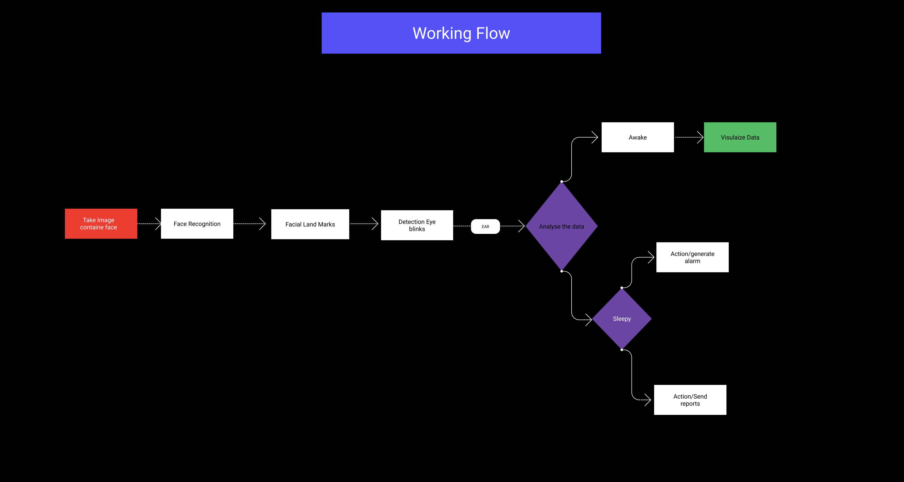

# Group Members

- Ali Rahhal ,Saadoun M Aldhirat ,Mahmood Dinah ,Haya Balasmeh and Roaa Mustafa

## Project Description

## Name of project : Drowsiness Detection

- At all sensitive works where it require high level of consciousness where the human error due to lack of attention could cause fatal consequences this raises an important concern for having a way or tool to detect this.

**_Deep Drowsiness Detection_** this app will detect if the person is sleepy, and if he is, this app will do a specific action by first sounding an alarm and also sending an email to the in charge person that can save the situation.

- So, it can be used as a safety technology to prevent human errors that consider critical for example in medical institutions when humman errors of sleepy doctors are fatal.

## Getting started

## Dependencies, Languages and Tools expected to be needed

- Python Programming Language
- YOLO ( you only look once) deep learning models
- OpenCv --> Library for Eye detection
- Numpy and Matplotlib  --> Library  for plotting and visualizing data
- Dlib , Pygame --> which will alert the driver when he feels sleepy
- Flask --> for predection

## MVP

- Face Recognition(find the facial landmarks such as eyes).

- Sleepy Face Detection(Eye Blink detection using  Eye Aspect Ratio(EAR))

- Do predection for Eyes if they are closed  or opened.

- Sending a Report.

- Generate alert.

## Working Flow

## Instulation

Installing YOLO
`pip3 install yolo34py`

Installing Numpy
`pip3 install numpy`

Installing Matplotlib
`pip3 install matplotlib`

Installing OpenCV
`pip3 install opencv-python`

Installing Dlib
`pip3 install dlib`

Installing Pygame
`pip3 install pygame`
