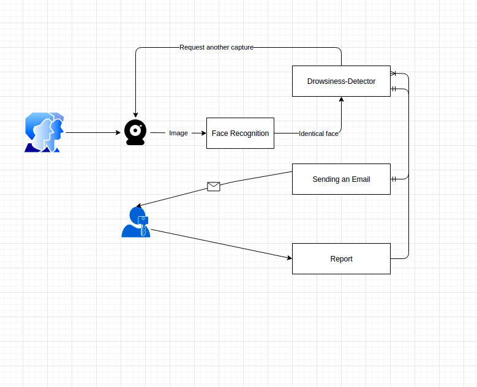
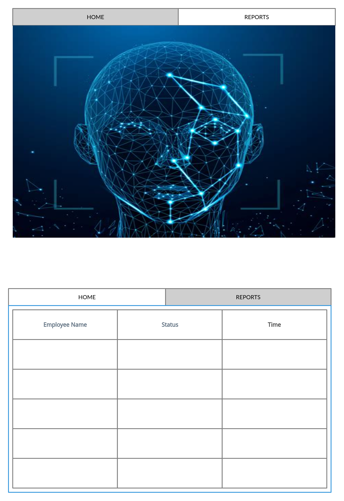

## User stories

[user stories](https://github.com/orgs/Data-Assassins/projects/1)

## As an administrative user I want to generate reports stating if the employee setting on the computer is awake or sleepy every 10 seconds.

## Feature tasks

- Face detection
- Drowsiness Detection
- Storing the results

## Acceptance tasks:

- Ensure that the application is recognising the human face is being recognised.
- Ensure that the application is detecting the drowsiness and awakeness of the user.
- Ensure that the application is storing the informations generated.
- Ensure that the reports generated in one minute is 6 reports.

## Estimation:

- Large

## As an adiminstrative user I want to be able to access all the reports of my employees.

### Feature tasks

- The client can have an option to veiw the employees reports
- The client can filter the reports generated by time and date.
- The client can filter the reports by labeling them to awake or sleepy.

## Acceptance Tests:

- Ensure that all reports generated in specific time period are stored properly.
- Ensure that in case the client filtered the options by label only the reports related are shown.

## Estimation

- Medium

## As an administrative user I want the reports to not be modified by the employees

### Feature tasks

- The client can choose that the employees have the option of veiweing only.

## Acceptance tests

- Ensure that if the user is non administrative then it cannot change any reports.

## Estimation:

- small

## As an administrative user I want an alarm message to be shown to the employee to warn them

## Feature tasks:

- The non-administrative user recieve a an alarm message.

## Acceptance tests:

- Ensure that if the report is awake an alarm will be shown on the front of their screen.

## Estimation:

- Large.

## As non administrative user I want an email to be send to me in case the employee was sleepy.

## Feature tasks

- The administrative user recieve an email when the report is sleepy.

## Acceptance tests

- Ensure each time the report was sleepy to send an email to the client.
- Ensure in case the report was awake no emails are sent.
- Ensure the email sent have the proper report
- Ensure the email recipent is the client address.

## Estimation

- Large.

## Domain Modeling

## Wireframe

